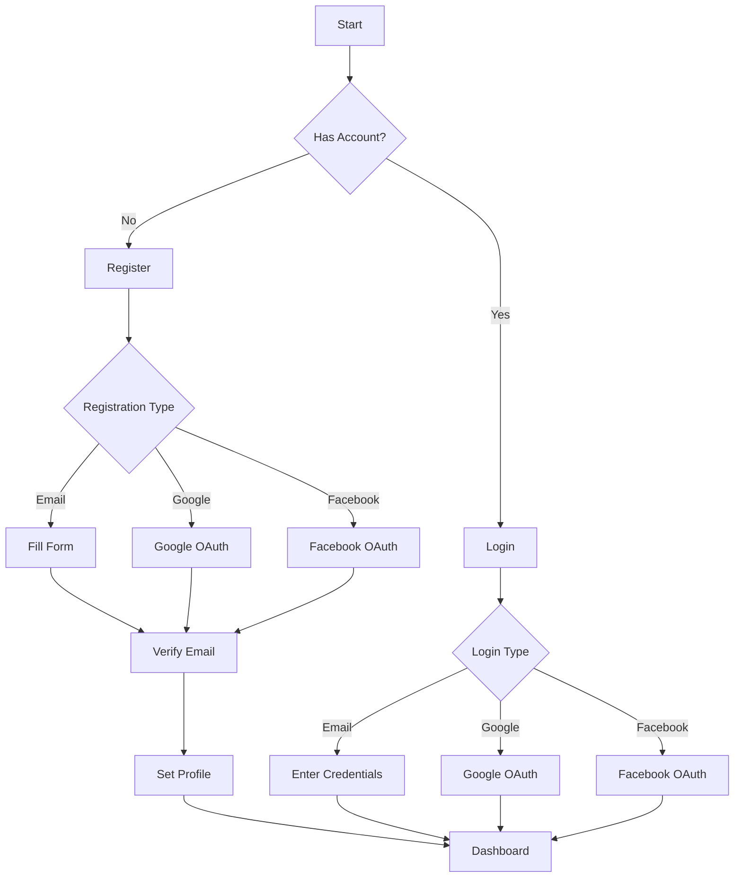

```mermaid
flowchart TD
    A[Start] --> B{Has Account?}
    B -->|No| C[Register]
    B -->|Yes| D[Login]
    C --> E{Registration Type}
    E -->|Email| F[Fill Form]
    E -->|Google| G[Google OAuth]
    E -->|Facebook| H[Facebook OAuth]
    
    F & G & H --> I[Verify Email]
    I --> J[Set Profile]
    J --> K[Dashboard]
    
    D --> L{Login Type}
    L -->|Email| M[Enter Credentials]
    L -->|Google| N[Google OAuth]
    L -->|Facebook| O[Facebook OAuth]
    
    M & N & O --> K
```
