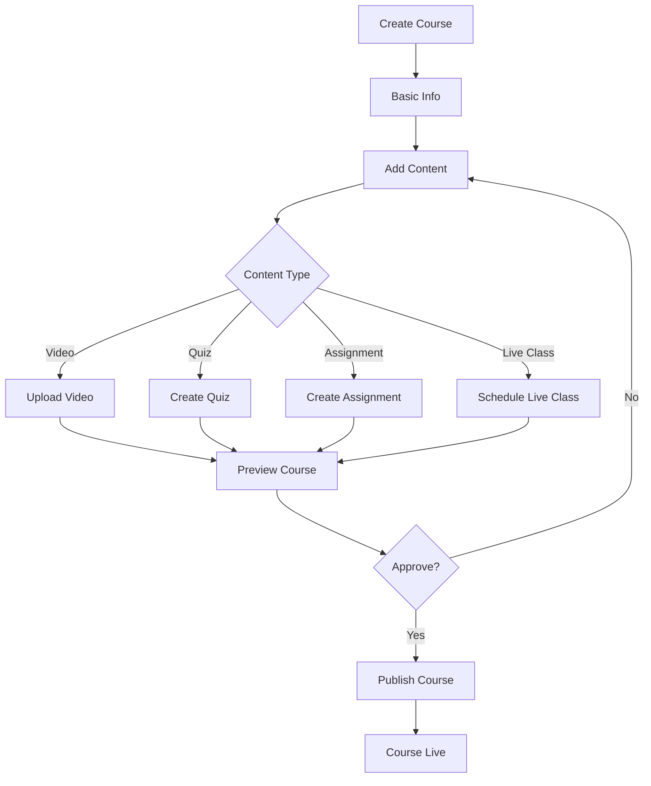

```mermaid
flowchart TD
    A[Create Course] --> B[Basic Info]
    B --> C[Add Content]
    C --> D{Content Type}
    D -->|Video| E[Upload Video]
    D -->|Quiz| F[Create Quiz]
    D -->|Assignment| G[Create Assignment]
    D -->|Live Class| H[Schedule Live Class]
    
    E & F & G & H --> I[Preview Course]
    I --> J{Approve?}
    J -->|Yes| K[Publish Course]
    J -->|No| C
    K --> L[Course Live]
```
