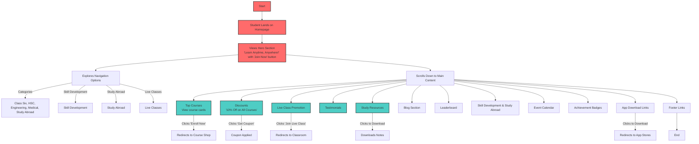

```mermaid
flowchart TD
    A[Start] --> B[Student Lands on Homepage]
    B --> C[Views Hero Section<br>'Learn Anytime, Anywhere!' with 'Join Now' button]
    C --> D[Explores Navigation Options]
    
    %% Navigation Categories
    D -->|Categories| E1[Class Six, HSC, Engineering, Medical, Study Abroad]
    D -->|Skill Development| E2[Skill Development]
    D -->|Study Abroad| E3[Study Abroad]
    D -->|Live Classes| E4[Live Classes]
    
    %% Main Content Flow
    C --> F[Scrolls Down to Main Content]
    
    %% Primary Features
    F --> G1[Top Courses<br>View course cards]
    F --> G2[Discounts<br>'10% Off on All Courses']
    F --> G3[Live Class Promotion]
    F --> G4[Testimonials]
    F --> G5[Study Resources]
    
    %% Secondary Features
    F --> G6[Blog Section]
    F --> G7[Leaderboard]
    F --> G8[Skill Development & Study Abroad]
    F --> G9[Event Calendar]
    F --> G10[Achievement Badges]
    
    %% Interactive Elements
    G1 -->|Clicks 'Enroll Now'| H1[Redirects to Course Shop]
    G2 -->|Clicks 'Get Coupon'| H2[Coupon Applied]
    G3 -->|Clicks 'Join Live Class'| H3[Redirects to Classroom]
    G5 -->|Clicks to Download| H5[Downloads Notes]
    
    %% Bottom Section
    F --> I[App Download Links]
    I -->|Clicks to Download| J[Redirects to App Stores]
    F --> K[Footer Links]
    K --> L[End]
    
    %% Styling
    classDef primary fill:#ff6b6b,stroke:#333,stroke-width:2px
    classDef secondary fill:#4ecdc4,stroke:#333,stroke-width:2px
    class A,B,C primary
    class G1,G2,G3,G4,G5 secondary
```
