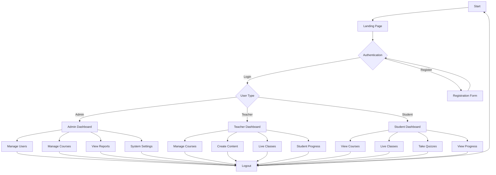

```mermaid
flowchart TD
    A[Start] --> B[Landing Page]
    B --> C{Authentication}
    C -->|Login| D{User Type}
    C -->|Register| E[Registration Form]
    E --> C
    D -->|Admin| F[Admin Dashboard]
    D -->|Teacher| G[Teacher Dashboard]
    D -->|Student| H[Student Dashboard]
    
    F --> F1[Manage Users]
    F --> F2[Manage Courses]
    F --> F3[View Reports]
    F --> F4[System Settings]
    
    G --> G1[Manage Courses]
    G --> G2[Create Content]
    G --> G3[Live Classes]
    G --> G4[Student Progress]
    
    H --> H1[View Courses]
    H --> H2[Live Classes]
    H --> H3[Take Quizzes]
    H --> H4[View Progress]
    
    F1 & F2 & F3 & F4 --> Z[Logout]
    G1 & G2 & G3 & G4 --> Z
    H1 & H2 & H3 & H4 --> Z
    Z --> A
```
