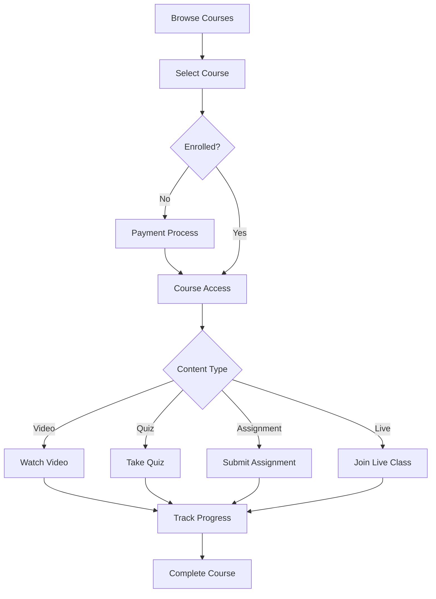

```mermaid
flowchart TD
    A[Browse Courses] --> B[Select Course]
    B --> C{Enrolled?}
    C -->|No| D[Payment Process]
    D --> E[Course Access]
    C -->|Yes| E
    E --> F{Content Type}
    F -->|Video| G[Watch Video]
    F -->|Quiz| H[Take Quiz]
    F -->|Assignment| I[Submit Assignment]
    F -->|Live| J[Join Live Class]
    
    G & H & I & J --> K[Track Progress]
    K --> L[Complete Course]
```
